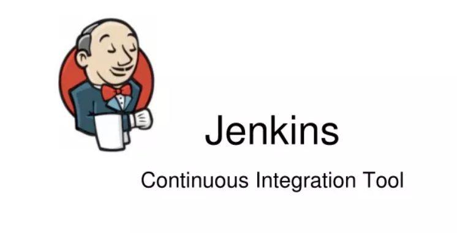

# jenkins-training

Building CICD DevOps pipelines with Jenkins, Docker and Ansible

## Description:


- **Jenkins**, an open source, cross-platform software package, enables you to set up this infrastructure.
- In this course, you'll learn how to deploy a continuous integration and deployment chain. You'll also learn how to set up a "Pipeline As Code" using Jenkinsfile.

## Prerequisites (but not mandatory):
- [x] Docker
- [x] Git

## What was learned:

- **Installating and configuring a jenkins server**
- **Deploying jenkins using docker**
- **Creating pipelines to build, test and deploy your containerized applications**
- **Deploying an applications in the cloud with heroku**
- **Writing pipelines in groovy using the jenkinsfile**
- **Using Jenkins with ansible to automate your deployments**

## Tutorial: Jenkins Job

### Job for deploying Docker WebApp

In this tutorial we are going to create a Jenkins job that deploys a Docker web application. The Jenkins job will take two parameters: IMAGE_NAME and IMAGE_TAG, allowing you to specify the Docker image to be deployed with its corresponding tag.

#### Steps

1. **Create a New Jenkins Job**:

- Log in to your Jenkins instance.
- Click on "New Item" to create a new job.
- Enter a name for the job (e.g., "Deploy Docker WebApp") and select "Freestyle project," then click "OK."

2. **Configure Job Parameters**:

In the job configuration, scroll down to the "Build" section.

- Click on "Add Parameter" and select "String Parameter."
- Set the name as IMAGE_NAME and provide a default value (e.g., mywebapp).
- Add another "String Parameter" named IMAGE_TAG with a default value (e.g., latest).
- In this case:
    - IMAGE_NAME = alpinehelloworld
    - IMAGE_TAG = latest

3. **Configure Build Steps**:

- In the "Build" section, click on "Add build step" and select "Execute shell" (if your Jenkins environment is Unix-like) or "Execute Windows batch command" (if your Jenkins environment is Windows).

- In the build step, enter the following script to deploy the Docker web application using the provided IMAGE_NAME and IMAGE_TAG parameters:
```bash
#!/bin/bash

git clone https://github.com/mansourka06/alpinehelloworld.git
cd alpinehelloworld
docker build -t ${IMAGE_NAME}:${IMAGE_TAG} .

```
&#x1F4DD; **Note:** You can adapt the script as needed to match your application's specific deployment requirements.

4. **Save and run the Job**

- Click "Save" to save the job configuration.
- On the job's main page, click "Build with Parameters."
- Enter the desired values for IMAGE_NAME and IMAGE_TAG, then click "Build."
- Jenkins will execute the job, pulling the specified Docker image and deploying the web application using the provided parameters.

## Tuto conclusion 
Congratulations! You've successfully created a Jenkins job that deploys a Docker web application using the specified Docker image name and tag as parameters. This job can be further customized and extended based on your project's requirements.


## Troubleshooting

If you encounter any issues while setting up or running the Jenkins job, here are some common problems and their solutions:

&#x1F6AB; **Error:** `fatal: destination path 'PATH_NAME' already exists and is not an empty directory.`

This error occurs when the directory specified for the project already exists in the workspace and is not empty. The Jenkins workspace is used to clone repositories and build projects. If you're using a version control system like Git, it's possible that a repository has been cloned in the workspace directory.

**Solution:**
Ensure that your Jenkins job properly manages the workspace, either by cleaning it before each build or using a unique workspace for each build.

&#x1F6AB; **Error:** `ERROR: permission denied while trying to connect to the Docker daemon socket at unix:///var/run/docker.sock`

This error indicates that the Jenkins user doesn't have the necessary permissions to access the Docker daemon socket. The Docker daemon socket is used to communicate with the Docker engine.

**Solution:**
To resolve this issue, follow these steps:

- Grant the Jenkins user permissions to access the Docker daemon socket by adding it to the `docker` group:
   
```bash
sudo usermod -aG docker $USER
sudo usermod -aG docker jenkins
sudo service jenkins restart
```
&#x1F4DD; **Note:** This gives the Jenkins user the necessary privileges to interact with Docker.


## Author
Mansour KA